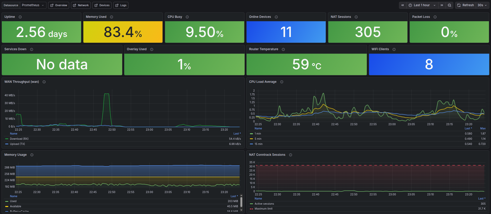
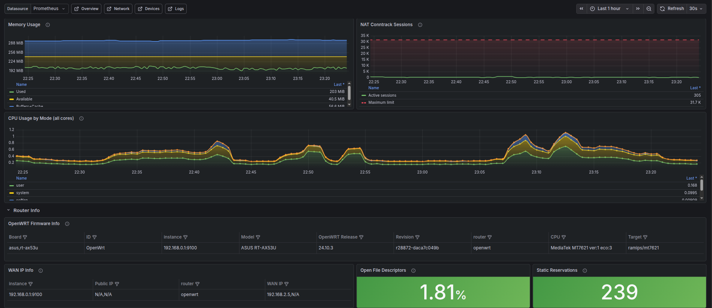
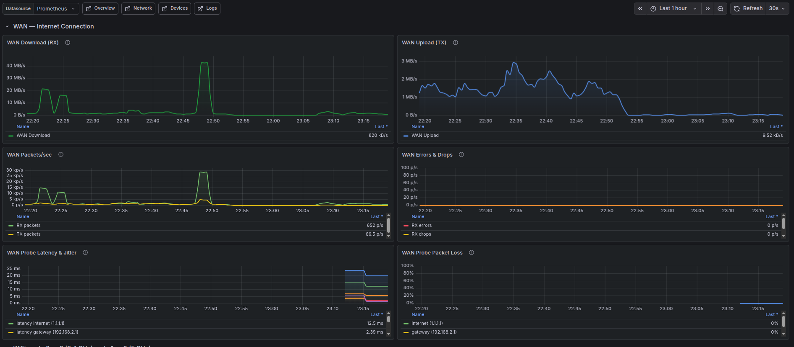
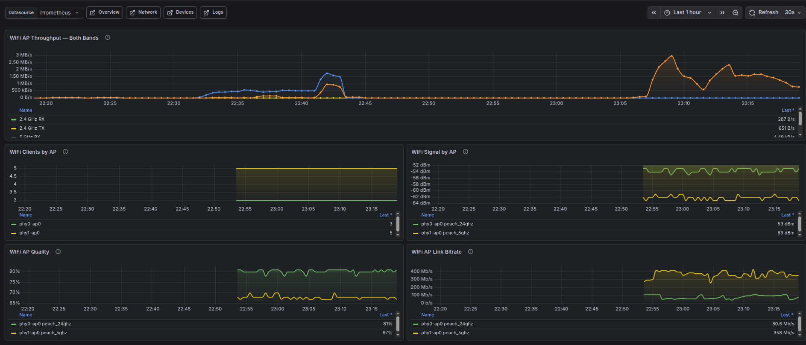
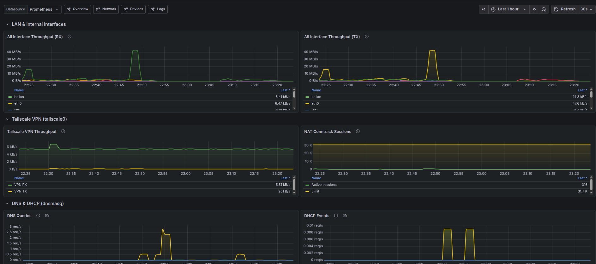
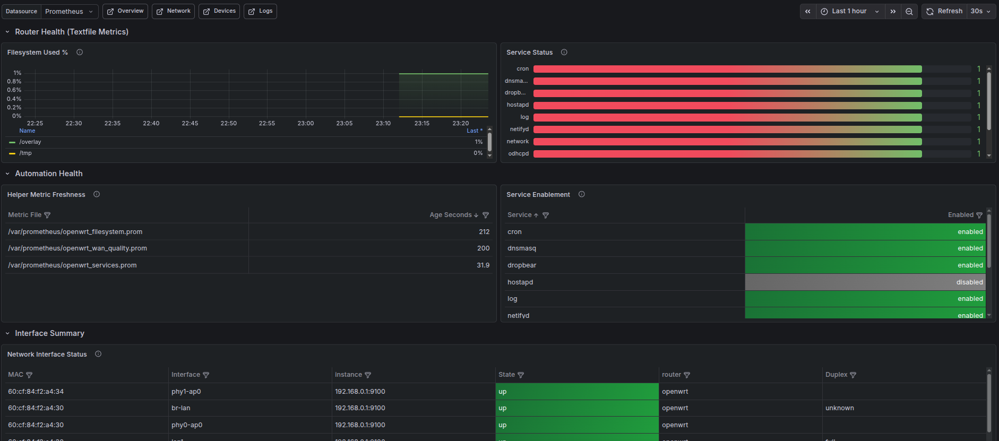
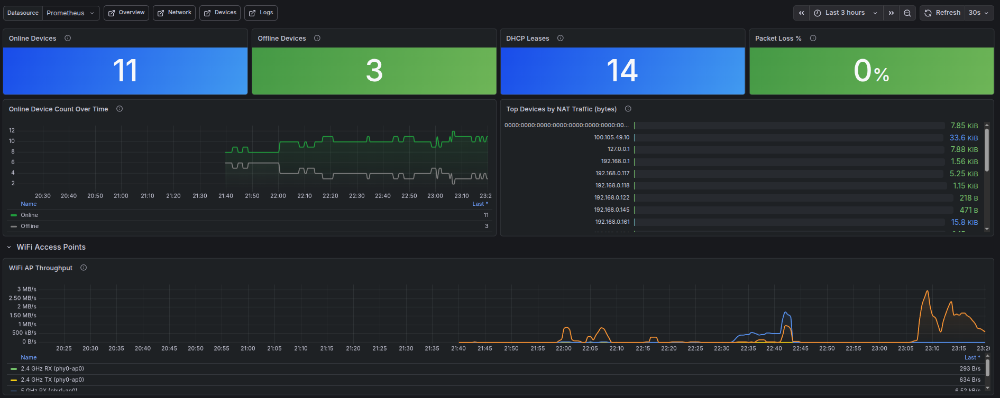
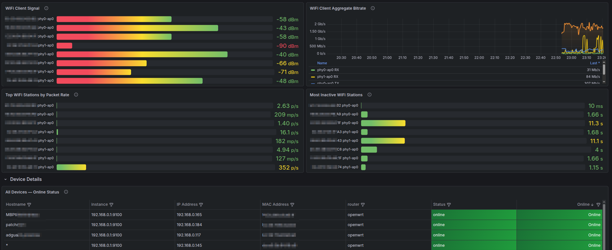
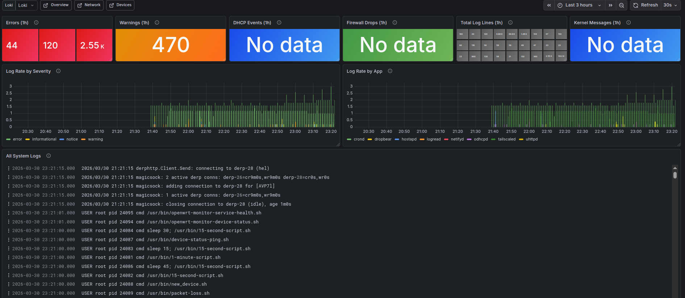

# OpenWRT Grafana Monitor

Full observability stack for OpenWRT routers — metrics, logs, and dashboards in a single `docker compose up`.

**Stack**: [`grafana/otel-lgtm`](https://github.com/grafana/docker-otel-lgtm) (Grafana + Prometheus + Loki + Tempo) + Grafana Alloy

## What you get

| | |
|---|---|
| **CPU & memory** | Load average, memory usage %, free memory |
| **Network** | Per-interface RX/TX (WAN/LAN/WiFi AP/Tailscale), WAN latency/jitter/loss probes, DNS query rates, DHCP events |
| **Devices** | Per-device online/offline status, NAT traffic top-10, DHCP lease table, static reservations |
| **Router health** | Router temperature, overlay/tmp usage, service health, WiFi client counts and signal metrics when supported |
| **NAT** | Active conntrack sessions, limit usage |
| **Logs** | All syslog events, DHCP assignments, firewall drops, kernel messages |

4 pre-built dashboards: Overview · Network · Devices · Logs

> Tested on **ASUS RT-AX53U** (MediaTek MT7621, OpenWRT 24.10.3). WAN interface: `wan`. WiFi APs: `phy0-ap0` / `phy1-ap0`.

## Dashboard previews

### Overview

| | |
|---|---|
|  |  |

### Network

| | |
|---|---|
|  |  |
|  |  |

### Devices

| | |
|---|---|
|  |  |

### Logs



## Prerequisites

- OpenWRT 21.02+ router
- A Linux machine on the LAN (runs Docker)
- Docker 24+ and Docker Compose v2

## Quick start

### Step 1 — Router (SSH in)

Recommended: copy the bundled router directory and run the setup script:

```sh
scp -r openwrt root@192.168.0.1:/tmp/
ssh root@192.168.0.1 "sh /tmp/openwrt/setup.sh 192.168.0.100"
```

The router setup installs the official exporter packages, copies the bundled
collector files from `openwrt/collectors/`, installs helper scripts from
`openwrt/scripts/`, enables the textfile collector for custom metrics, configures the exporter to listen on LAN, and enables
remote syslog to the monitoring host over TCP.

Manual install is still possible, but you must install the required packages,
set `prometheus-node-exporter-lua.main.listen_interface='lan'`, and copy the
bundled router-side files yourself. See `docs/openwrt-setup.md`.

### Step 2 — Monitoring host

```sh
git clone https://github.com/your-username/openwrt-grafana-monitor
cd openwrt-grafana-monitor
cp .env.example .env
# Edit .env: set ROUTER_IP and MONITORING_HOST_IP
docker compose up -d
```

### Step 3 — Open Grafana

**http://localhost:3000** — login: `admin` / `changeme` (or your `GRAFANA_ADMIN_PASSWORD`)

---

## Configuration

All settings are in `.env`:

| Variable | Default | Description |
|---|---|---|
| `ROUTER_IP` | `192.168.0.1` | Your OpenWRT router's IP |
| `ROUTER_NAME` | `openwrt` | Label used in Grafana |
| `MONITORING_HOST_IP` | `192.168.0.100` | This machine's IP (router sends syslog here) |
| `SCRAPE_INTERVAL` | `30s` | How often to pull metrics |
| `GRAFANA_ADMIN_PASSWORD` | `changeme` | Grafana admin password |
| `SYSLOG_PORT` | `514` | Syslog listener port |

## Architecture

```
OpenWRT Router
├── prometheus-node-exporter-lua + textfile metrics → :9100/metrics
└── logd remote syslog → TCP :514
         │
         ▼
Monitoring Host (Docker)
├── Grafana Alloy
│   ├── scrapes :9100 → Prometheus
│   └── receives syslog → Loki
└── grafana/otel-lgtm
    ├── Prometheus :9090
    ├── Loki       :3100
    ├── Tempo      :3200
    └── Grafana    :3000  ← you're here
```

See [PLAN.md](PLAN.md) for the full architecture and design decisions.

## Docs

- [OpenWRT setup guide](docs/openwrt-setup.md)
- [Monitoring host setup](docs/monitoring-host-setup.md)
- [Troubleshooting](docs/troubleshooting.md)
- [Full implementation plan](PLAN.md)

## Repo structure

```
.
├── docker-compose.yml           # Stack: otel-lgtm + Alloy
├── .env.example                 # Configuration template
├── build_dashboards.py          # Python script that generates dashboard JSON
├── alloy/
│   └── config.alloy             # Alloy: scrape + syslog + forward
├── grafana/
│   └── provisioning/
│       ├── datasources/         # Auto-configured Prometheus + Loki + Tempo
│       └── dashboards/          # 4 pre-built dashboards (generated JSON)
│           ├── openwrt-overview.json
│           ├── openwrt-network.json
│           ├── openwrt-devices.json
│           └── openwrt-logs.json
├── openwrt/
│   ├── setup.sh                 # Router setup and installer for bundled files
│   ├── collectors/              # Custom Lua collectors used by the dashboards
│   └── scripts/                 # Router helper scripts called by cron
└── docs/                        # Detailed guides
```

## Adapting to your router

Edit `build_dashboards.py` and run `python3 build_dashboards.py` to regenerate dashboards if your router uses different interface names. Key variables are near the top of the file.
