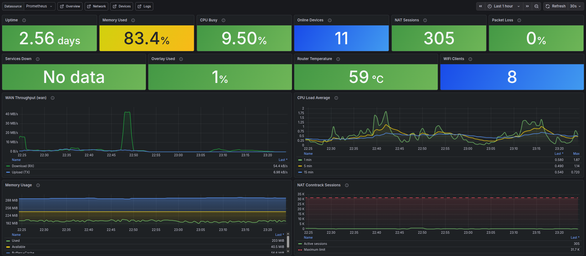
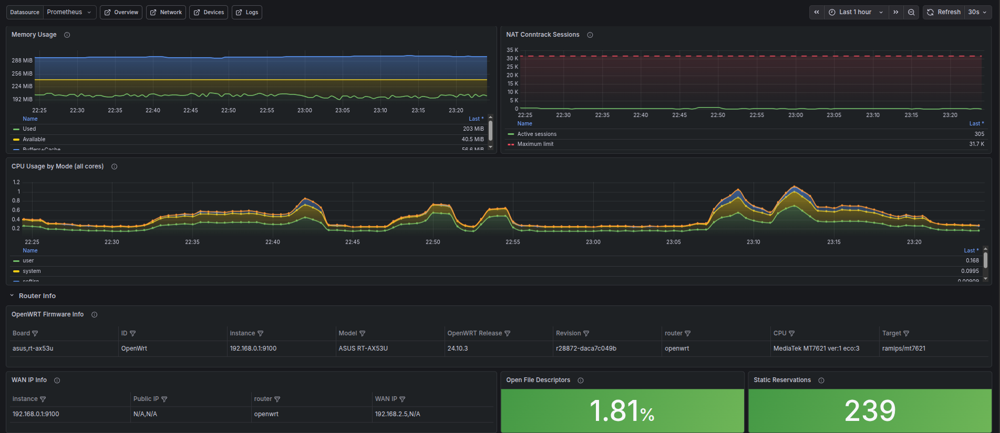
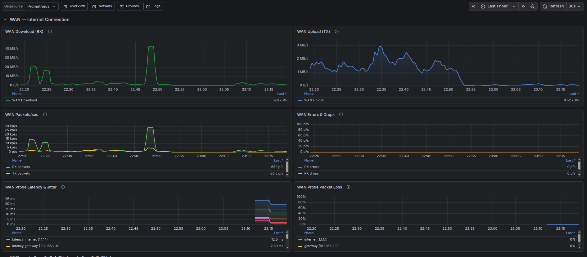
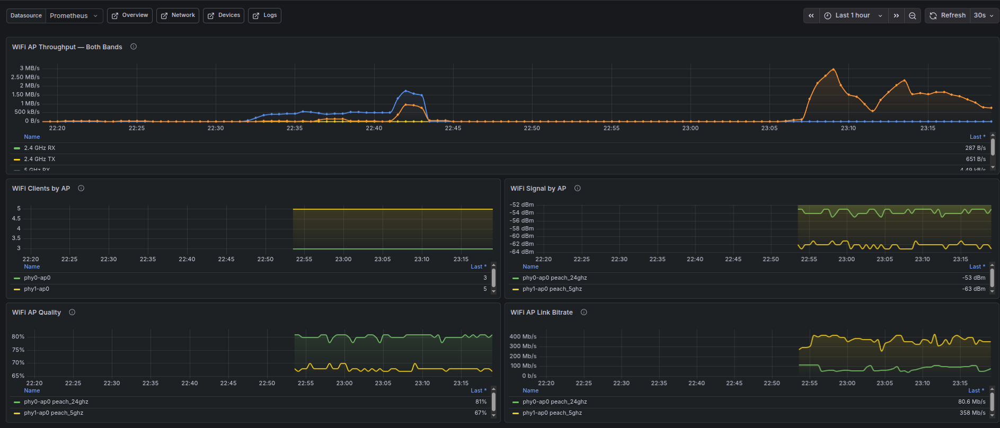
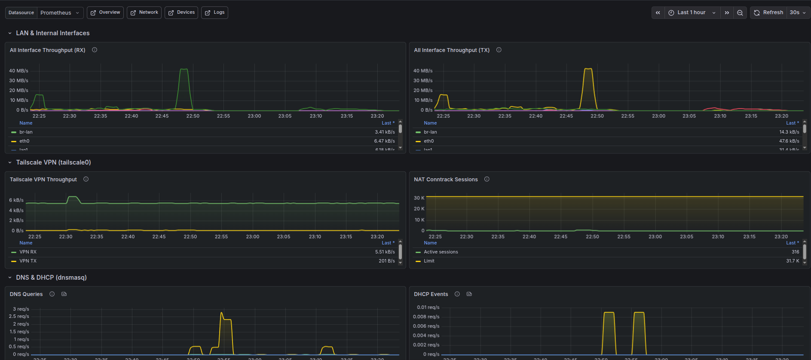
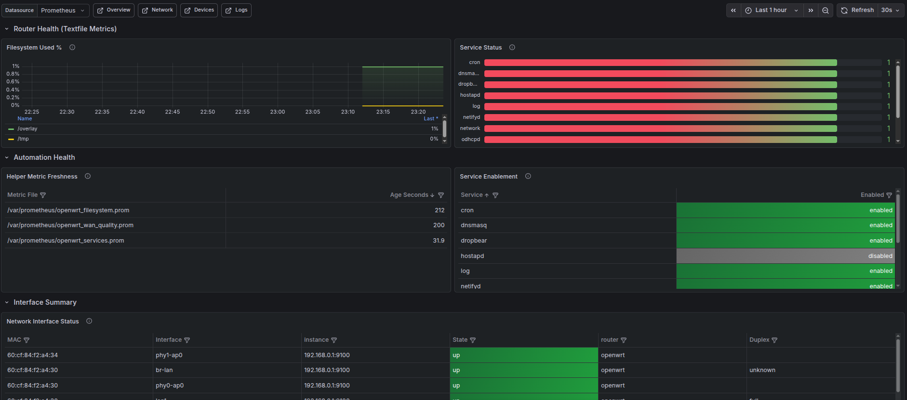
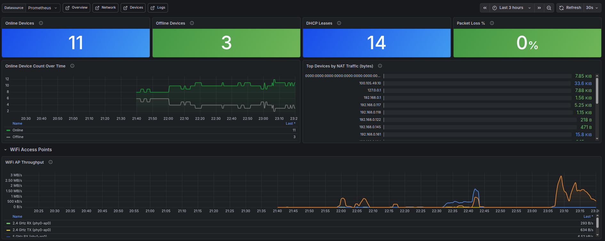
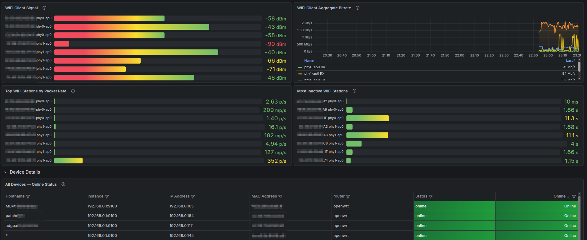
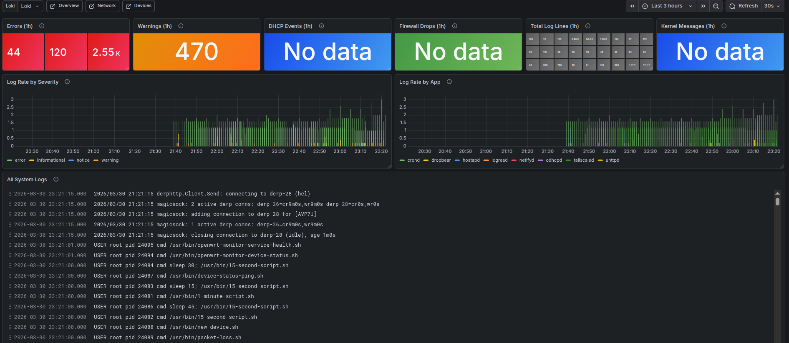

# OpenWrt Grafana Monitor

Full observability stack for OpenWrt routers: metrics, logs, and dashboards in a single `docker compose up`.

**Stack**: [`grafana/otel-lgtm`](https://github.com/grafana/docker-otel-lgtm) (Grafana + Prometheus + Loki + Tempo) + Grafana Alloy

## What you get

| | |
|---|---|
| **CPU & memory** | Load average, memory usage %, free memory |
| **Network** | Per-interface RX/TX (WAN/LAN/WiFi AP/Tailscale), WAN latency/jitter/loss probes, DNS query rates, DHCP events, firewall counters, link state/speed, softnet saturation, optional SQM/qdisc stats |
| **Devices** | Per-device online/offline status, NAT traffic top-10, DHCP lease table, static reservations |
| **Router health** | Router temperature, overlay/tmp usage, inode usage, service health, DHCP pool utilization, IPv6 WAN health, WiFi radio metrics when supported |
| **WiFi clients** | Per-station signal strength, TX/RX bitrate, packet rate, inactivity timer — requires `prometheus-node-exporter-lua-wifi_stations` |
| **NAT** | Active conntrack sessions, limit usage |
| **Logs** | All syslog events, DHCP assignments, firewall drops, kernel messages |

5 pre-built dashboards: Overview, Network, Devices, Logs, and Operations.

The four classic dashboards are generated from `build_dashboards.py`. The Grafana v2beta1 Operations dashboard is generated by `build_openwrt_operations_dashboard.py` into both `grafana/provisioning/dashboards/` and `grafana-dashboard-exports/`.

> Tested on **ASUS RT-AX53U** (MediaTek MT7621, OpenWrt 24.10.3). Updated for OpenWrt 24.10/opkg and OpenWrt 25.12/apk package managers.

## Dashboard previews

### Overview

| | |
|---|---|
|  |  |

### Network

| | |
|---|---|
|  |  |
|  |  |

### Devices

| | |
|---|---|
|  |  |

### Logs



## Prerequisites

- OpenWrt 24.10 or 25.12 router
- A Linux machine on the LAN (runs Docker)
- Docker 24+ and Docker Compose v2

## Quick start

### Step 1 — Router

Recommended: copy the bundled router directory and run the setup script:

```sh
scp -O -r openwrt root@192.168.0.1:/tmp/
ssh root@192.168.0.1 "sh /tmp/openwrt/setup.sh 192.168.0.100"
```

The `-O` flag forces legacy scp mode for OpenWrt/dropbear systems without an SFTP server. Replace `192.168.0.100` with the LAN IP of the monitoring host.

The router setup installs the official exporter packages, copies the bundled
collector files from `openwrt/collectors/`, installs helper scripts from
`openwrt/scripts/`, enables the textfile collector for custom metrics, configures the exporter to listen on LAN, and enables
remote syslog to the monitoring host over UDP by default. The helper scripts include
service/device health, WAN probes, DHCP pool metrics, link health, softnet
stats, IPv6 WAN health, inode pressure, firewall counters, SQM/qdisc stats,
and WiFi radio details.

OpenWrt 24.10 uses `opkg`; OpenWrt 25.12 and newer use `apk`. The setup script detects the available package manager automatically. Do not use `apk upgrade` on OpenWrt; use sysupgrade/attended sysupgrade for firmware upgrades.

Manual install is still possible, but you must install the required packages,
set `prometheus-node-exporter-lua.main.listen_interface='lan'`, and copy the
bundled router-side files yourself. See `docs/openwrt-setup.md`.

### Step 2 — Monitoring host

```sh
git clone <your-repo-url>
cd openwrt-grafana-monitor
cp .env.example .env
# Edit .env: set ROUTER_IP and MONITORING_HOST_IP
docker compose up -d
```

### Step 3 — Open Grafana

**http://localhost:3000** — login: `admin` / `changeme` (or your `GRAFANA_ADMIN_PASSWORD`)

---

## Configuration

All settings are in `.env`:

| Variable | Default | Description |
|---|---|---|
| `ROUTER_IP` | `192.168.0.1` | Your OpenWrt router's IP |
| `ROUTER_NAME` | `openwrt` | Label used in Grafana |
| `ROUTER_METRICS_PORT` | `9100` | Router exporter port |
| `MONITORING_HOST_IP` | `192.168.0.100` | This machine's IP (router sends syslog here) |
| `SCRAPE_INTERVAL` | `30s` | How often to pull metrics |
| `GRAFANA_ADMIN_PASSWORD` | `changeme` | Grafana admin password |
| `SYSLOG_PORT` | `514` | Syslog listener port |

Router setup accepts `EXPORTER_LISTEN_INTERFACE=lan`, `SYSLOG_PORT=514`, `SYSLOG_PROTO=udp`, `PING_TARGET=1.1.1.1`, `DNS_PROBE_HOST=openwrt.org`, and `DNS_PROBE_TIMEOUT=5` if the defaults do not fit your network.

## Architecture

```
OpenWrt Router
├── prometheus-node-exporter-lua + textfile metrics → :9100/metrics
└── logd remote syslog → UDP :514
         │
         ▼
Monitoring Host (Docker)
├── Grafana Alloy
│   ├── scrapes :9100 → Prometheus
│   └── receives syslog → Loki
└── grafana/otel-lgtm
    ├── Prometheus :9090
    ├── Loki       :3100
    ├── Tempo      :3200
    └── Grafana    :3000  ← you're here
```


## Docs

- [OpenWrt setup guide](docs/openwrt-setup.md)
- [Monitoring host setup](docs/monitoring-host-setup.md)
- [Troubleshooting](docs/troubleshooting.md)

## Repo structure

```
.
├── docker-compose.yml           # Stack: otel-lgtm + Alloy
├── .env.example                 # Configuration template
├── build_dashboards.py          # Python script that generates dashboard JSON
├── alloy/
│   └── config.alloy             # Alloy: scrape + syslog + forward
├── grafana/
│   └── provisioning/
│       ├── datasources/         # Auto-configured Prometheus + Loki + Tempo
│       └── dashboards/          # Provisioned dashboards (generated JSON)
│           ├── openwrt-overview.json
│           ├── openwrt-network.json
│           ├── openwrt-devices.json
│           ├── openwrt-logs.json
│           └── openwrt-operations-v2.json
├── grafana-dashboard-exports/    # Manual-import copy of the v2 dashboard
│   └── openwrt-operations-v2.json
├── grafana dashboards/           # Preserved dashboard exports from the PR branch
├── openwrt/
│   ├── setup.sh                 # Router setup and installer for bundled files
│   ├── collectors/              # Custom Lua collectors used by the dashboards
│   └── scripts/                 # Router helper scripts called by cron
└── docs/                        # Detailed guides
```

## Adapting to your router

Dashboards include variables for router name, WAN interface, WiFi AP interfaces, and VPN interface. Change them in Grafana first. If you want different defaults, edit `build_dashboards.py` and run:

```sh
python3 build_dashboards.py
```

The defaults are:

| Variable | Default | Description |
|---|---|---|
| WAN interface | `wan` | Your WAN uplink interface name |
| 2.4 GHz WiFi AP | `phy0-ap0` | First WiFi AP interface |
| 5 GHz WiFi AP | `phy1-ap0` | Second WiFi AP interface |
| Tailscale VPN | `tailscale0` | VPN tunnel interface (omit panels if not used) |

WiFi AP interface names follow OpenWrt's `phy<radio>-ap<vap>` convention. Run `ip link show` on your router to find the actual names — they appear after `openwrt` interface setup completes. If you only have one WiFi radio, remove the `phy1-ap0` targets from the WiFi panels.
