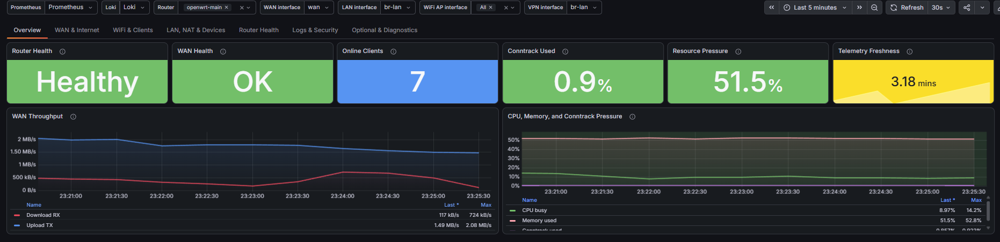
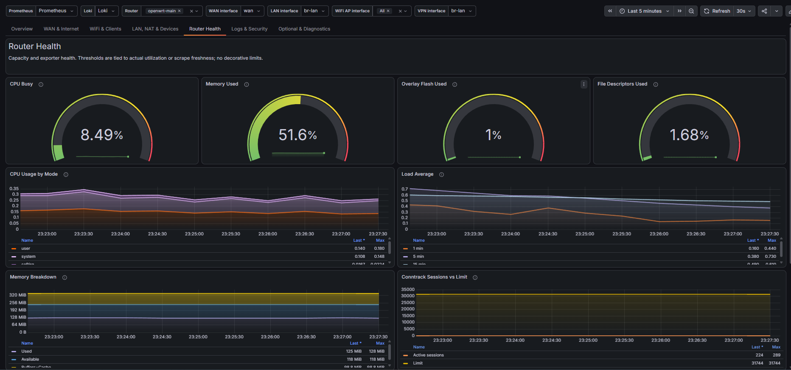

# OpenWrt Grafana Monitor

Self-hosted observability for OpenWrt routers: Prometheus metrics, syslog,
Grafana dashboards, and optional per-flow NetFlow visibility in one Docker
Compose stack.

The default stack uses [Grafana OTEL-LGTM](https://github.com/grafana/docker-otel-lgtm)
and Grafana Alloy. Router-side collectors are POSIX shell and Lua 5.1 so they
run on standard OpenWrt installations without a custom firmware image.

## What You Get

- CPU, memory, temperature, filesystem, inode, service, and conntrack health
- WAN latency, jitter, packet loss, DNS, IPv6, link, firewall, and SQM metrics
- DHCP leases, device state, bounded client traffic, and WiFi client quality
- Unified client identity with MAC, hostname, IP, network, radio, and SSID data
- Multi-router scraping with router-scoped labels and topology reconciliation
- Remote syslog in Loki, including DHCP, firewall, kernel, and service logs
- Optional guarded SSH MCP sidecar for router diagnostics and maintenance
- Optional Akvorado NetFlow stack for flow, application, destination, and ASN data

Nine dashboards are included in the default stack: Overview, Network, Devices,
Logs, Operations, Clients, Advanced Monitoring, Topology, and Mission Control.
NetFlow is an additional opt-in dashboard and Compose profile because it adds
Kafka, ClickHouse, Redis, and significant memory usage.

## Dashboard Preview





The generated v2 dashboards are available as manual-import files in
[`grafana-dashboard-exports/`](grafana-dashboard-exports/). Docker provisioning
uses the matching files under `grafana/provisioning/dashboards/`.

## Requirements

- OpenWrt 24.10 or newer on the router
- Linux host on the same network as the router
- Docker 24 or newer
- Docker Compose v2

The bundled installer supports OpenWrt systems using either `opkg` or `apk`.
It detects the package manager; do not run `apk upgrade` for firmware updates.

## Quick Start

### 1. Install the router collectors

Copy the router directory to the device and run the installer with the LAN IP
of the monitoring host:

```sh
scp -O -r openwrt root@<router-lan-ip>:/tmp/
ssh root@<router-lan-ip> \
  "sh /tmp/openwrt/setup.sh <monitoring-host-ip>"
```

The installer configures the official Prometheus Lua exporter, bundled
collectors, textfile helpers, LAN metrics access, and remote syslog.

For optional capabilities, set a profile before running the installer:

```sh
OPENWRT_MONITOR_PROFILE=clients,traffic,wifi_mesh \
  sh /tmp/openwrt/setup.sh <monitoring-host-ip>
```

See [Advanced Router Profiles](docs/advanced-profiles.md) for dependencies and
fail-closed behavior.

### 2. Configure the monitoring host

```sh
git clone <repository-url>
cd openwrt-grafana-monitor
cp .env.example .env
# Edit .env with the router and monitoring-host addresses.
docker compose up -d
```

For multiple routers, set `ROUTER_TARGETS` in `.env`:

```dotenv
ROUTER_TARGETS=main=<router-ip>:9100,access-point=<ap-ip>:9100
```

Each target becomes a bounded `router` label while retaining
`job="openwrt"`.

### 3. Open Grafana

Open <http://localhost:3000>. The default login is `admin` / `changeme` unless
you set `GRAFANA_ADMIN_PASSWORD`. Change the password before exposing Grafana
outside the local host or trusted network.

## Configuration

The main settings are in `.env`:

| Variable | Default | Purpose |
| --- | --- | --- |
| `ROUTER_IP` | `192.168.0.1` | Single-router metrics address |
| `ROUTER_NAME` | `openwrt` | Single-router Grafana label |
| `ROUTER_TARGETS` | unset | Comma-separated multi-router targets |
| `ROUTER_METRICS_PORT` | `9100` | Router exporter port |
| `MONITORING_HOST_IP` | `192.168.0.100` | Host receiving router syslog |
| `SCRAPE_INTERVAL` | `30s` | Alloy scrape interval |
| `SYSLOG_PORT` | `514` | Syslog listener port |
| `GRAFANA_ADMIN_PASSWORD` | `changeme` | Grafana admin password |

Optional MCP settings are documented in [SSH MCP sidecar](docs/mcp-ssh.md).
Keep `.env`, SSH credentials, host keys, and router data out of Git.

## Optional Features

### Router profiles

The installer profiles are `core`, `traffic`, `wifi_mesh`, `dpi`, `clients`,
and `full`. Missing dependencies fail closed and dashboards display explicit
unavailable states instead of plausible zeroes.

### NetFlow and Akvorado

NetFlow is disabled by default. Read [NetFlow and Akvorado](docs/netflow-akvorado.md),
create the local `akvorado/exporters.yaml`, then start it with:

```sh
docker compose --profile netflow up -d
```

Hardware flow offload can make packet accounting incomplete. The dashboard
keeps that limitation visible and should not be treated as a billing-grade
traffic counter.

### SSH MCP sidecar

The sidecar is optional and guarded by authentication, router allowlists, and
explicit confirmation for mutations. Keep it localhost-bound unless private
network exposure and matching Host/Origin allowlists are configured.

## Architecture

```text
OpenWrt router
  prometheus-node-exporter-lua + custom collectors -> :9100/metrics
  logd remote syslog -> Alloy
           |
           v
Monitoring host
  Grafana Alloy -> Prometheus and Loki in Grafana OTEL-LGTM
  Grafana       -> http://localhost:3000
```

For Kubernetes installations using an existing Prometheus and Loki, see
[Kubernetes monitoring setup](docs/kubernetes-monitoring-setup.md).

## Repository Layout

```text
alloy/                         Alloy scrape and syslog configuration
akvorado/                      Optional NetFlow configuration
docs/                          Operator and deployment documentation
grafana/provisioning/          Docker-provisioned datasources, alerts, dashboards
grafana-dashboard-exports/     Manual-import dashboard JSON and legacy exports
openwrt/                       Router installer, collectors, helpers, and modules
scripts/                       Dashboard and vendor-table generators
tests/                         Offline shell, Lua, Python, and dashboard checks
```

Edit generators under `scripts/`, never generated JSON directly. Regenerate
the dashboard copies with:

```sh
python3 -m scripts.build_dashboards
python3 -m scripts.build_openwrt_operations_dashboard
python3 -m scripts.build_openwrt_clients_dashboard
python3 -m scripts.build_openwrt_advanced_dashboard
python3 -m scripts.build_openwrt_topology_dashboard
python3 -m scripts.build_openwrt_mission_control
python3 -m scripts.build_openwrt_netflow_dashboard
```

The IEEE vendor table is refreshed separately with
`python3 -m scripts.build_oui_table` and requires registry access.

## Documentation

- [OpenWrt setup guide](docs/openwrt-setup.md)
- [Advanced router profiles](docs/advanced-profiles.md)
- [Monitoring host setup](docs/monitoring-host-setup.md)
- [Kubernetes monitoring setup](docs/kubernetes-monitoring-setup.md)
- [NetFlow and Akvorado](docs/netflow-akvorado.md)
- [SSH MCP sidecar](docs/mcp-ssh.md)
- [Troubleshooting](docs/troubleshooting.md)
- [Repository map](docs/repository-map.md)

## Local Validation

```sh
python3 -m unittest discover -s tests -p 'test_*.py'
sh -n openwrt/setup.sh openwrt/scripts/*.sh
docker compose config
sh tests/run_all.sh
```

The default checks are offline. Set `ROUTER_METRICS_URL` only for an authorized
live duplicate-series check.

## License

A license will be added before the public release.
